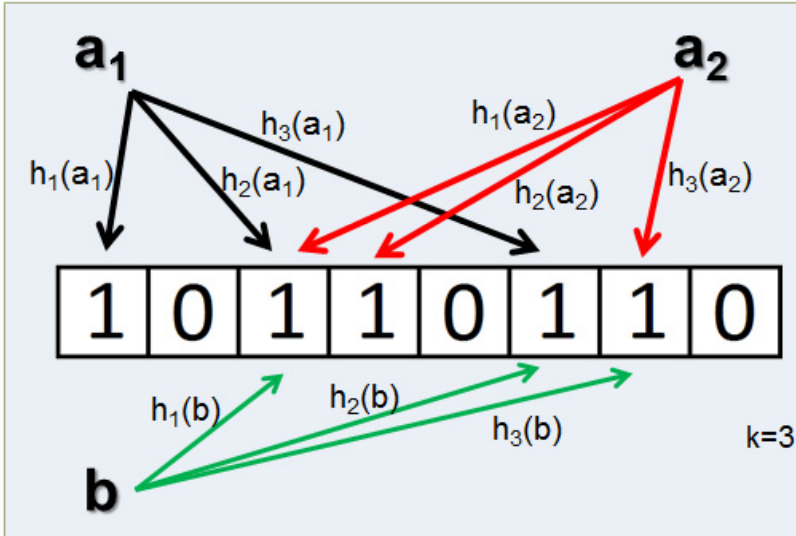

# FashtTable: Fast Hash Table
A fast HashTable built with the purpose of implementing a fast search on account of accuracy.

## Usage
### Parameters
1. M - number of bits for hash table
2. K - number of hash functions
3. inputFile - comma separated (.csv) file serves as input for table building
4. testFile - comma separated (.csv) file serves as input for table testing

## Description
The table is built of M bits and K hash functions (user input).
Each of the hash functions' output is distributed uniformly over [0..M-1].
Meaning each hash calculation has an equal chance of $1 \over M$ to be equal to any value in [0..M-1]. 

## Actions
### Table Initialization
The table starts out with all M bits as 0. Whenever a new member is inserted the needed bits are turned on (=1).

### Member Insertion
Inserting a member into the structure includes a calculation of K hash functions on the given value.
Each value from of the K hash functions is translated to turning on the bit in the corresponding index.

### Member Searching
In order to test whether the current value is a member of the hash table, the same K hash functions are calculated and 
the corresponding bits are checked accordingly. 
Only if all the bits are on, the value is said to be a member.

Therefore, the probability of false positive is 0.

Membership testing consists of the calculation of K hash functions on the given value, uniformly distributed.
Therefore, there is chance of $1 - {1 \over M}$ that a function will not assign a value to a particular index.
The structure has N members, so the hash function ran a total of $N * K$ times.
Since the functions are uniformly distributed, the probability that any of the M bits will equal 0 after inserting N members is $$1 - (1 - {1 \over M})^{N*K}$$
Which leaves us with the probability that a certain index will be on after inserting N members into the structure (this is because we will be content with at least one function that will be loaded to the desired index).

Therefore, the probability of false negative is $$(1 - (1 - {1 \over M})^{N*K})^K$$

#### Insertion Example: 

